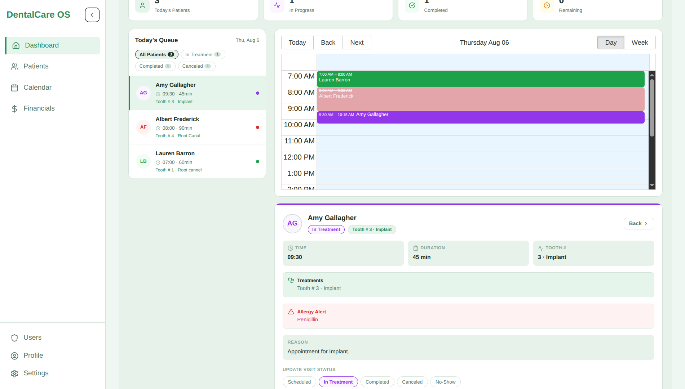
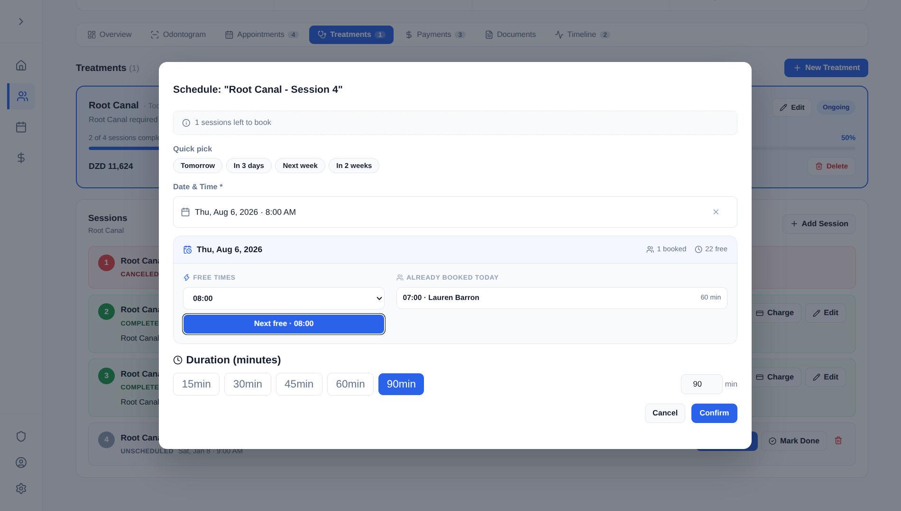
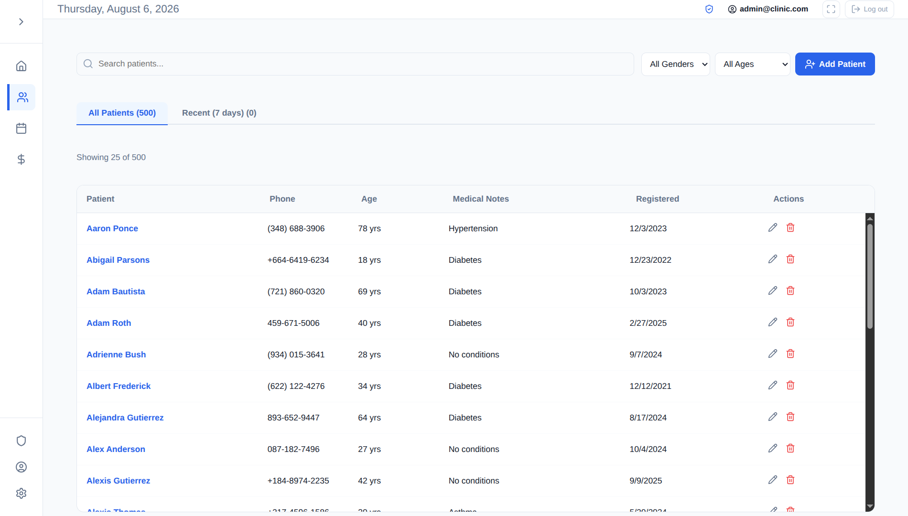
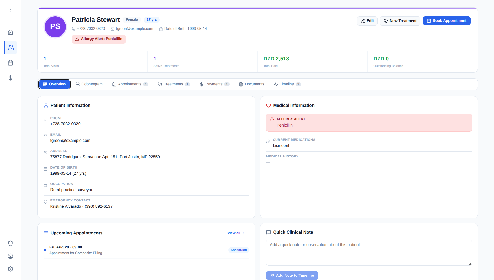
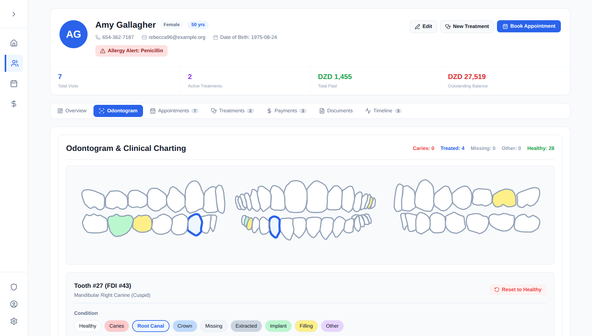
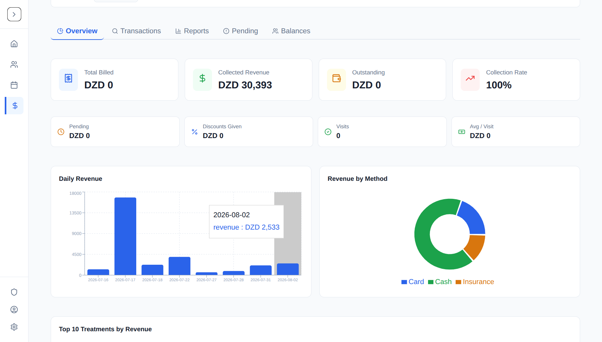

# 🦷 DentalCare OS <a id="top"></a>

**Production-grade dental clinic operating system** — patients, smart multi-session scheduling, interactive tooth charts, financials, and an encrypted document vault, wrapped in a real auth + RBAC + audit-trail security layer.

> Full-stack · FastAPI · React 19 · TypeScript · SQLite → PostgreSQL-ready

[](#)
[](#)
[](#)
[](#)
[](#)
[](#)
[](#)
[](#)

---

## What is this?

DentalCare is a complete practice-management web app I built from scratch — the kind of system a real clinic runs on. It moves everything a front-desk team and clinicians do every day into one tool: patient records, the day's appointments, multi-week treatment plans, a clickable dental chart, payments & receipts, documentation, and role-based access for admins, dentists, hygienists, and receptionists.

It's also a showcase for how I think about **security-sensitive software** — every piece of PHI (medical data, documents) is protected end-to-end, and the session model is designed against real-world attack classes. More below under [Security](#security).

## Screenshots

| Dashboard — the practice at a glance | Smart multi-session scheduling |
|---|---|
| Today's appointments, upcoming treatments, quick stats. | Book multi-session plans with automatic free-slot suggestion. |
|  |  |

| Patient directory | Patient profile |
|---|---|
| Searchable records with medical history & emergency contacts. | Full timeline: visits, treatments, payments, documents, teeth. |
|  |  |

| Interactive odontogram | Financials |
|---|---|
| Click-to-edit condition for every tooth — caries, crowns, implants. | Payments, discounts, insurance, receipts + summary dashboard. |
|  |  |

*The UI ships in **English, French, and Arabic** (full RTL), with dark & light themes.*

## Features

- **Smart scheduling** — appointments + multi-session treatment plans; the system detects the next available slot for the preferred week-day (with optional collision checks)
- **Patient-first records** — search, allergies & medications, emergency contacts, and a time-stamped treatment/visit timeline
- **Interactive odontogram** — per-tooth conditions tracked visually (healthy, caries, root canal, crown, missing, implant…)
- **Financials** — payment, discounts, insurance, receipts, and an aggregated income summary
- **Document vault** — patient uploads (X-rays, referrals) with type allow-list, size caps, and encryption at rest
- **Role-based clinic staffing** — admin / dentist / hygienist / receptionist with per-page permissions
- **Admin approval flow** — new self-registrations are locked until an admin approves them
- **Fully localized** — English, Français, العربية (RTL) + dark/light themes

## 👮 Security (a real differentiator)

This project treats security as a feature. Highlights:

- **Passwords** — hashed with **argon2id** (legacy bcrypt auto-upgraded). Never stored, never returned.
- **Sessions** — short-lived JWTs kept **in memory only** (XSS can't steal them); refresh cookies are **HttpOnly, Secure, SameSite=Lax**, and **rotate on every use**; auto-logout after 30 min inactivity; rate limiting + per-account lockout.
- **PHI at rest** — patient medical fields and **uploaded files are symmetrically encrypted (Fernet/AES-128-GCM)** before touching disk.
- **Tamper-evident audit log** — every mutation is recorded in an HMAC-SHA256 hash chain; integrity is verifiable in-app.
- **RBAC everywhere** — admin/dentist/hygienist/receptionist enforced server-side, not just hidden buttons.
- **Hardened API** — strict Content-Security-Policy injected at build, HSTS, CORS allow-list, Host-header validation, upload hardening (extension allow-list, MIME re-derived server-side, double-extension blocked).
- **Fail-fast boot** — in production it refuses to start with default/weak secrets.
- **57 automated tests** verifying all of the above.

Full assessment & recommendations: [`sec.md`](sec.md).

## Tech Stack

| Layer | Tech |
|---|---|
| **Frontend** | React 19 · TypeScript · Vite · React Router · Axios · react-big-calendar · recharts · lucide-react |
| **Backend** | Python 3.10+ · FastAPI · SQLAlchemy · SQLite (PostgreSQL-ready) · PyJWT · passlib/argon2 · Fernet · slowapi |
| **Testing** | pytest (57 tests) · ESLint · tsc |

## Getting started

```bash
# Backend — API on http://127.0.0.1:8000 (docs at /docs)
cd backend
python3 -m venv venv && source venv/bin/activate
pip install -r requirements.txt
uvicorn main:app --reload
```

```bash
# Frontend — dev UI on http://localhost:5173
cd frontend
npm install
npm run dev
```

### First logins

```bash
cd backend
DEMO_MODE=1 ./venv/bin/python seed_db.py 0      # demo users only (dev)
```

| Role | Email | Password |
|---|---|---|
| **Administrator** | `admin@clinic.com` | `9tqrgf5MXABIp3DauGcU+1Tn` |
| Dentist | `doctor1@demo.com` | `doctor123` |
| Receptionist | `secretary1@demo.com` | `secretary123` |

> Demo accounts only exist after you run the local seed script — they are never created in production. Full setup + deploy guide: [`SETUP_GUIDE.md`](SETUP_GUIDE.md).

### Tests

```bash
cd backend && ./venv/bin/python -m pytest tests/ -q    # 57 tests
cd frontend && npm run build && npm run lint
```

## Deployment

- **Frontend → Netlify**: 1-click config (`netlify.toml`): build, SPA fallback, security headers, and an optional `/api` same-origin proxy for the backend.
- **Backend**: host the FastAPI service behind HTTPS (Render / Railway / Fly.io / VPS + nginx). Set `ENV=production`, `JWT_SECRET`, `ENCRYPTION_KEY`, `ADMIN_SETUP_SECRET`, `CORS_ORIGINS`, `TRUSTED_HOSTS`.

Full checklist: [`SETUP_GUIDE.md`](SETUP_GUIDE.md).

## Project layout

```
./ backend/               FastAPI: routes, auth, models, encryption, tests
   frontend/              React SPA: pages, components, contexts, API client
   imgs/                  Screenshots for this README
   netlify.toml           Netlify build + SPA + /api proxy
   SETUP_GUIDE.md         Setup & production deployment guide
   sec.md                 Security assessment & threat-model write-up
```

**Why this is a great production project to look around in.** The code separates Redis-style concerns cleanly (`models.py` / `schemas.py` / `crud.py`), the auth layer is a single readable module (`auth.py`) that underpins everything, and there's an in-hooks test suite that actually asserts on attacks (token replay, audit tampering, upload polyglots, account lockout).

## Roadmap

- [ ] PostgreSQL switch (ready in `database.py`, just point `DATABASE_URL`)
- [ ] Admin MFA (TOTP)
- [ ] ClamAV scanning of uploads
- [ ] Add PWA install + offline fallback

## Contact

Built with a lot of coffee and even more `pytest`. Questions/opportunities — reach out on GitHub.

[Back to top](#top)